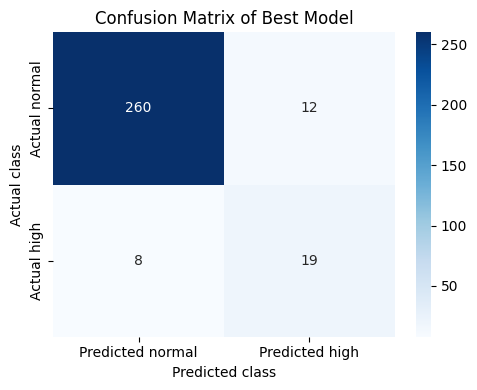
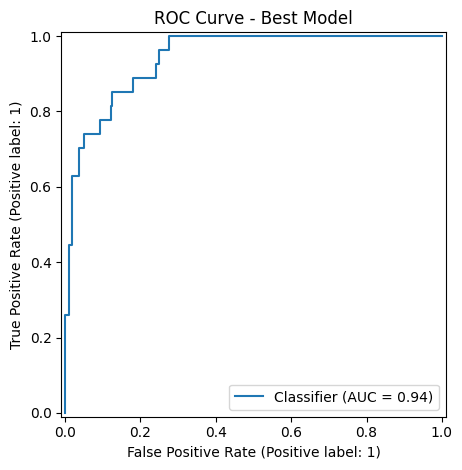
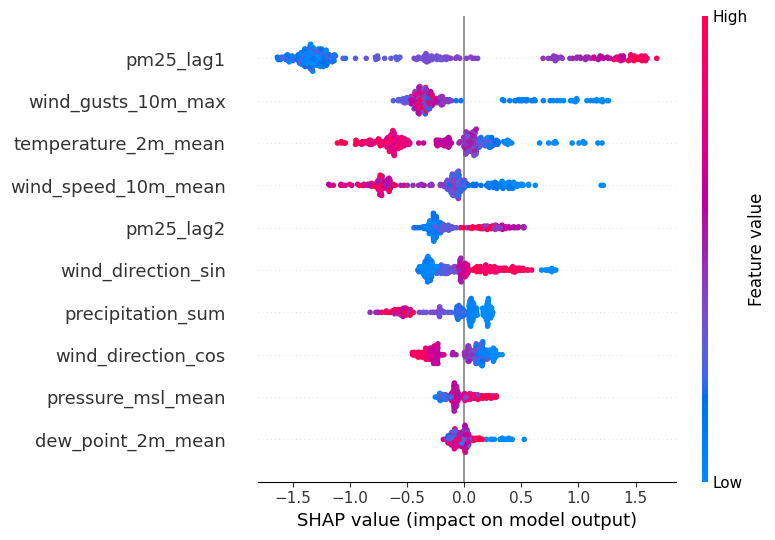
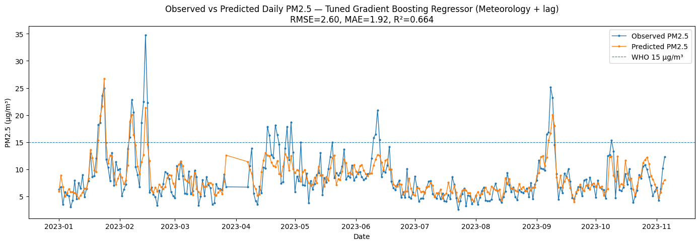
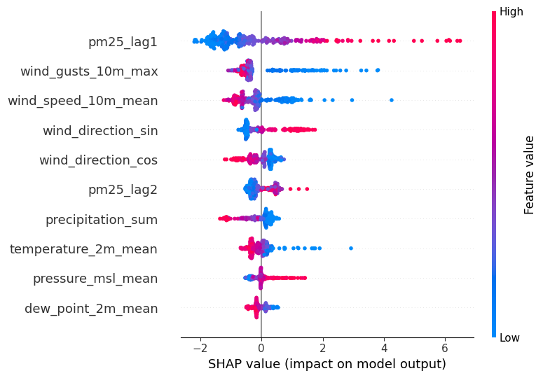

# Air Quality Intelligence

Machine learning and time-series analysis for predicting daily PM2.5 pollution in Manchester using meteorological conditions and historical air-quality data.

This project compares classification, regression and genuine one-day-ahead forecasting approaches while using time-aware validation to avoid temporal leakage.

---

## Project Overview

Daily PM2.5 observations from the Manchester Piccadilly monitoring site were combined with meteorological data to investigate two related problems:

**High-pollution detection**  
Predict whether daily PM2.5 exceeds 15 µg/m³.

**PM2.5 concentration modelling**  
Predict the continuous daily PM2.5 concentration.

A separate ARIMAX experiment was developed for genuine **one-day-ahead forecasting** using only lagged meteorological information and calendar features.

The analysis covers **January 2021 to November 2023**.

---

## Key Results

| Task | Best Model | Features | Main Results |
|---|---|---|---|
| High-pollution classification | Cost-sensitive Gradient Boosting | Meteorology + PM2.5 lags | F1 **0.655**, Recall **0.704**, ROC-AUC **0.942** |
| PM2.5 regression | Tuned Gradient Boosting | Meteorology + PM2.5 lags | RMSE **2.598**, MAE **1.923**, R² **0.664** |
| One-day-ahead forecasting | ARIMAX(1,0,0) | Lagged weather + annual seasonality | RMSE **3.107**, MAE **2.234**, R² **0.518** |

The selected classifier correctly detected **19 of 27 high-PM2.5 days** in the 2023 holdout period.

---

## Classification

Random Forest and Gradient Boosting classifiers were tested using:

- meteorological variables only
- meteorological variables + PM2.5 lag features
- class weighting
- cost-sensitive learning
- SMOTE

Hyperparameters were selected using expanding-window `TimeSeriesSplit` on **2021–2022 only**. The 2023 period remained separate for final evaluation.

### Selected Classifier

**Cost-sensitive Gradient Boosting — Meteorology + PM2.5 lags**

| Metric | 2023 Holdout |
|---|---:|
| Accuracy | 0.933 |
| Balanced Accuracy | 0.830 |
| Precision | 0.613 |
| Recall | 0.704 |
| F1-score | 0.655 |
| ROC-AUC | 0.942 |
| Average Precision | 0.699 |

### Confusion Matrix



### ROC Curve



### Model Explainability

SHAP was used to interpret the selected tree-based classifier.



Recent PM2.5 concentration, wind gusts, temperature and wind speed were among the strongest contributors to model predictions.

---

## Regression

Random Forest and Gradient Boosting regressors were evaluated using the same two feature sets.

Model selection was again performed using `TimeSeriesSplit` on the 2021–2022 development period before evaluation on 2023.

### Selected Regressor

**Tuned Gradient Boosting — Meteorology + PM2.5 lags**

| Metric | 2023 Holdout |
|---|---:|
| RMSE | 2.598 µg/m³ |
| MAE | 1.923 µg/m³ |
| R² | 0.664 |

### Observed vs Predicted PM2.5



### Regression Explainability



---

## One-Day-Ahead ARIMAX Forecasting

A separate forecasting experiment was designed to represent a realistic one-day-ahead setting.

Unlike the classification and regression experiments, ARIMAX uses **previous-day meteorological variables**, historical model state and calendar features rather than same-day weather conditions.

Model-development strategy:

**2021:** candidate model fitting and ARIMA order selection  
**2022:** validation and feature-set selection  
**2021–2022:** final model fitting  
**2023:** walk-forward evaluation

The selected configuration was:

```text
ARIMAX(1,0,0)
Feature set: All lagged weather + annual seasonality
Predictors: 12
