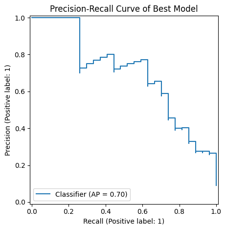
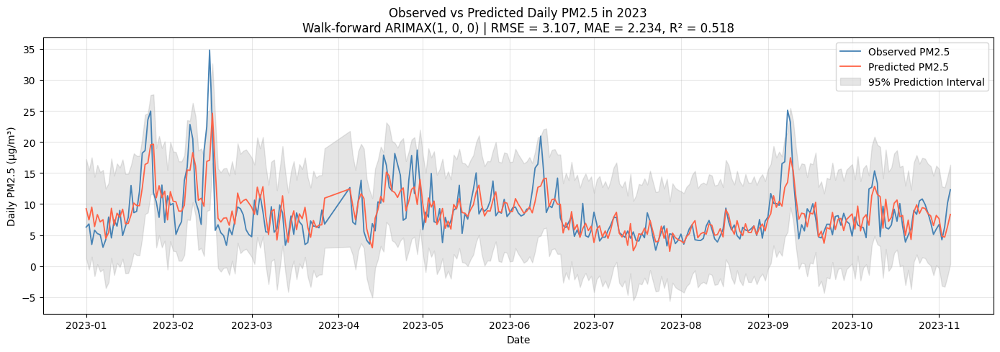
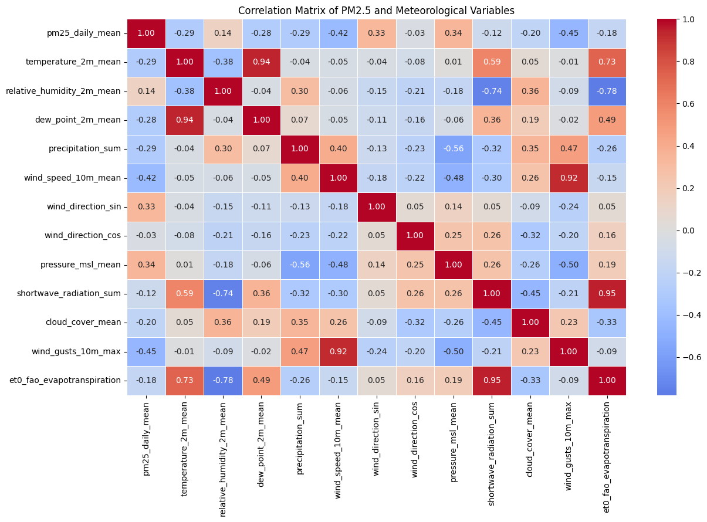

# Results

Key visual outputs from the PM2.5 modelling project.

## Classification

### Confusion Matrix

### Precision-Recall Curve

### ROC Curve

### SHAP Explainability

---

## Regression

### Observed vs Predicted PM2.5

### SHAP Explainability

---

## Time-Series Forecasting

### Walk-Forward ARIMAX Forecast

---

## Exploratory Analysis

### PM2.5 and Meteorological Correlations

